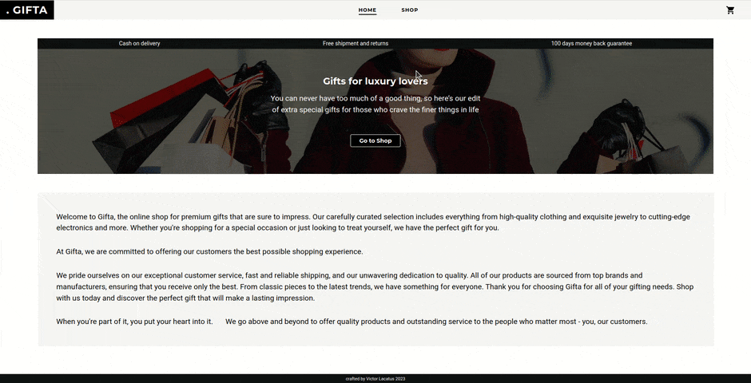

# Gifta

Gifta is a mock online store that fetches products from an API. With Gifta, users can browse products, search for specific items, and complete purchases. It is built using ReactJS with React Router, and it leverages React Hooks such as useState, useEffect, and useContext for state management. The app is responsive and easy to use, with an intuitive interface that makes it easy for users to find what they're looking for and complete their purchase.

## Demo

You can access a live version of the website by following this link:
https://georgevictor90.github.io/gifta/

## Features

- Responsive and easy-to-use interface
- Browse and search products from an API
- Search bar (Material UI component)
- Sort products by category and price
- Add products to a list of favorites
- Add items to the cart
- Adjust the quantity of each item in the cart
- See the total amount to pay, including shipping tax
- Built with ReactJS and React Router
- Uses React Hooks such as useState, useEffect, and useContext for state management

## Screenshots




## Tech Stack

This game was built using the following technologies and tools:

- [React](https://reactjs.org/) - A JavaScript library for building user interfaces
- [React Hooks](https://reactjs.org/docs/hooks-intro.html) - A new feature in React 16.8 that lets you use state and other React features without writing a class
- [Create React App](https://create-react-app.dev/) - A tool for creating React apps with no build configuration
- [React Router](https://reactrouter.com/) - A popular package for handling routing in React applications

## Run Locally

Clone the project

```bash
  git clone https://github.com/georgevictor90/gifta
```

Go to the project directory

```bash
  cd gifta
```

Install dependencies

```bash
  npm install
```

Start the server

```bash
  npm start
```

## License

[MIT](https://choosealicense.com/licenses/mit/)
